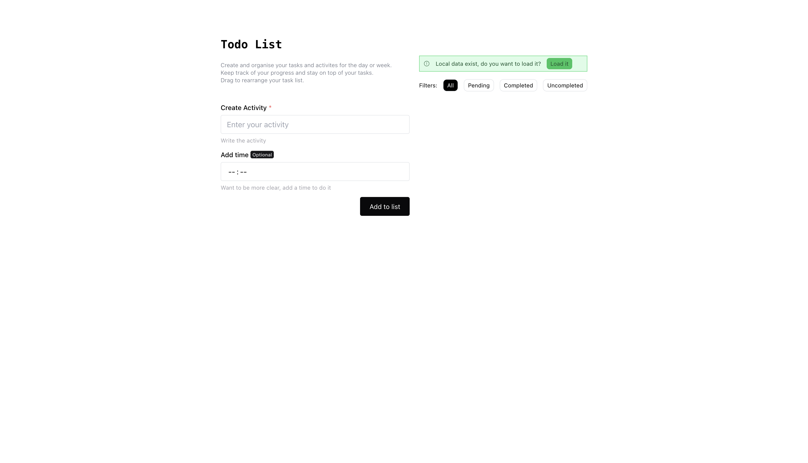
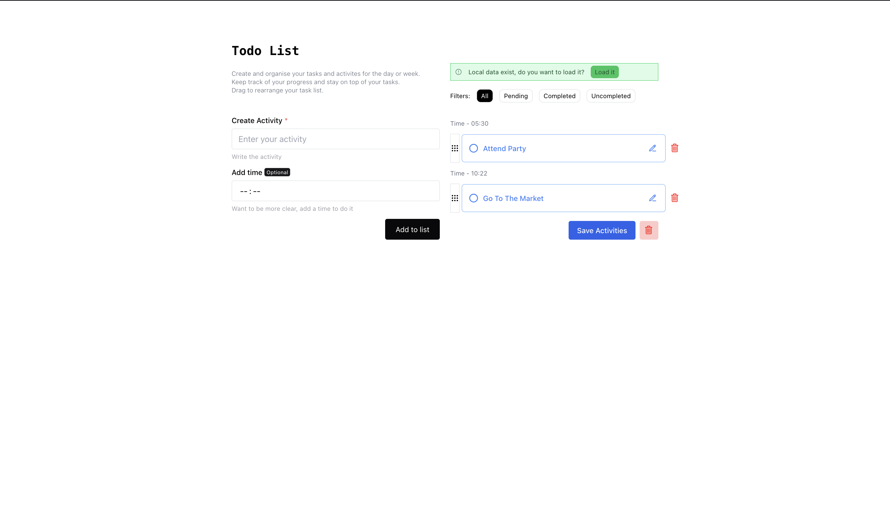

# Simple Todo App

You can add, delete, edit and rearrange the activites by simply dragging and dropping the items in the list.

## Screenshots




## Run Locally

Clone the project

```bash
  git clone https://link-to-project
```

Go to the project directory

```bash
  cd my-project
```

Install dependencies

```bash
  npm install
```

Start the server

```bash
  npm run dev
```
